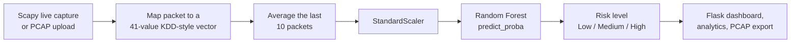
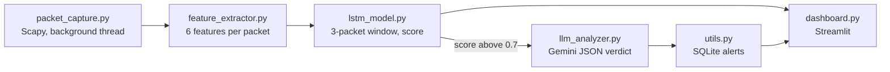
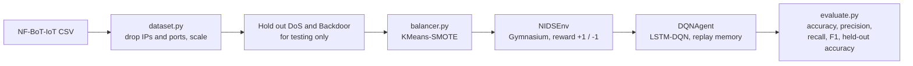

# NTF-IDS: network intrusion detection prototypes

Three Python experiments in detecting hostile network traffic, built as learning projects. Each folder runs on its own. They are prototypes, not validated detectors, so read [Known limitations](#known-limitations) before judging any result.

| Folder | Approach | Interface | Status |
|---|---|---|---|
| [`NIDS_Pretrained_Demo`](NIDS_Pretrained_Demo) | Random Forest (scikit-learn) trained on KDD Cup 99 records. Scores live packets captured with Scapy, or an uploaded PCAP. | Flask dashboard on port 5000, plus a command-line scan | Runs end to end. Live-packet feature mapping is simplified. |
| [`LSTM_LLM_NIDS`](LSTM_LLM_NIDS) | Packet features scored over a 3-packet window, with Google Gemini explaining flagged packets and alerts stored in SQLite. | Streamlit | Pipeline prototype. The LSTM is an untrained placeholder. |
| [`DRL_NIDS`](DRL_NIDS) | PyTorch LSTM-DQN agent with KMeans-SMOTE balancing and a split that holds DoS and Backdoor attacks out of training. | Streamlit, plus `train.py` and `evaluate.py` | Training and evaluation code complete. Needs the NF-BoT-IoT dataset, which is not included. |

## How each one works

### NIDS_Pretrained_Demo



The dashboard shows live counts, protocol distribution, packet trends and the most suspicious source IPs. A captured session can be downloaded as a PCAP.

| Endpoint | Method | Purpose |
|---|---|---|
| `/` | GET | Dashboard |
| `/api/interfaces` | GET | List capture interfaces |
| `/api/start_capture`, `/api/stop_capture` | POST | Control live capture |
| `/api/live_scan` | GET | Live statistics |
| `/api/get_packets` | GET | Recent packet log |
| `/api/analytics` | GET | Trends and top suspicious IPs |
| `/api/upload_pcap` | POST | Analyse an uploaded PCAP |
| `/api/download_pcap` | GET | Download the captured session |

`run_demo.py` runs the same model over the 50 sample records in `test_traffic.csv` from the command line. More background is in [`Architecture_Documentation.md`](NIDS_Pretrained_Demo/Architecture_Documentation.md).

### LSTM_LLM_NIDS



The six features are packet length, protocol, source port, destination port, TCP flags and time since the previous packet.

### DRL_NIDS



Hyperparameters live in [`DRL_NIDS/config.py`](DRL_NIDS/config.py): gamma 0.95, epsilon decaying from 1.0 to 0.05, learning rate 0.0005, replay memory 50,000, batch size 128, 100 training episodes.

## Run it

Use a virtual environment for each folder. Live capture needs administrator or root rights, and Npcap on Windows.

```bash
# 1. Random Forest dashboard
cd NIDS_Pretrained_Demo
pip install -r requirements.txt
python run_demo.py        # scan the 50 sample records in the terminal
python app.py             # dashboard at http://127.0.0.1:5000
```

```bash
# 2. LSTM and Gemini dashboard
cd LSTM_LLM_NIDS
pip install -r requirements.txt
streamlit run dashboard.py
```

The Gemini API key is optional. Paste it into the sidebar at run time. Without one, flagged packets get a fixed placeholder verdict.

```bash
# 3. Reinforcement-learning agent
cd DRL_NIDS
pip install -r requirements.txt
# Optional: put NF-BoT-IoT.csv in the repository root, one level above DRL_NIDS
python train.py           # trains and saves models/lstm_dqn.pth
python evaluate.py        # metrics on the test split
streamlit run dashboard.py
```

## Known limitations

These are the things a reviewer would find in the code, stated up front.

**NIDS_Pretrained_Demo**
- The model is a supervised Random Forest trained on labelled KDD Cup 99 records, a 1999 dataset. The architecture notes call this "zero-day detection". It has not been tested on attack types outside its training data here, so treat that wording as a goal, not a result.
- `extract_features` builds the 41-value vector from only the protocol and packet length. Other positions are constants or zero. Scores on live packets are therefore not comparable to scores on real KDD records.
- Live capture rewrites `capture_session.pcap`, so a capture session replaces the sample file.

**LSTM_LLM_NIDS**
- `mock_lstm_weights.h5` is generated on first run from random data for one epoch. It is not a trained model.
- In `evaluate_anomaly`, the final score is set by rules (very fast SYN/RST traffic, tiny packets, unusual protocols) with random values inside fixed ranges. The LSTM output does not decide the verdict. This folder shows the pipeline and the dashboard, not a working LSTM detector.
- When a Gemini key is set, flagged packet metadata (source and destination IPs, ports, length, flags) is sent to Google's API. Do not use a key on traffic you are not allowed to share.

**DRL_NIDS**
- Each sample is a one-step episode (`done` is always true) and the LSTM sees a sequence length of 1, so there is no multi-step decision making.
- If `NF-BoT-IoT.csv` is missing, `train.py` writes a synthetic random dataset under that name and trains on it. Results on it mean nothing. Delete that file before using real data.
- If PyTorch cannot be imported, `train.py` falls back to a mock agent that writes a placeholder model file.
- No metrics or training log are committed with `models/lstm_dqn.pth`, so do not read it as a benchmark.

**All three**
- `pretrained_model.pkl` and `lstm_dqn.pth` are binary model files. Loading a pickle can run code, so only load model files you trust.
- `app.py` starts Flask with `debug=True`. Run it on localhost only.
- There are no automated tests, and `DRL_NIDS` and `LSTM_LLM_NIDS` dependencies are not pinned to tested versions.

## Ideas for next steps

- Train the LSTM on labelled packet or flow sequences and remove the heuristic override.
- Replace the simplified feature mapping with a real flow-feature extractor that matches the training data.
- Report precision, recall and F1 on a held-out attack type, with the training log committed.
- GeoIP view, threat-intelligence lookups, SIEM export, Docker, and authentication on the dashboard.

## Repository layout

```text
.
├── NIDS_Pretrained_Demo/   Flask dashboard, Random Forest model, sample traffic
├── LSTM_LLM_NIDS/          Streamlit dashboard, Scapy capture, Gemini analyser
├── DRL_NIDS/               PyTorch LSTM-DQN agent, environment, data pipeline
├── LICENSE
└── README.md
```

## Responsible use

Capture and analyse traffic only on networks you own or are authorised to monitor. Interception without permission can break the law and organisational policy.

## License

[MIT](LICENSE). Written by [E Chandu Reddy](https://chandureddy-sec.github.io).
